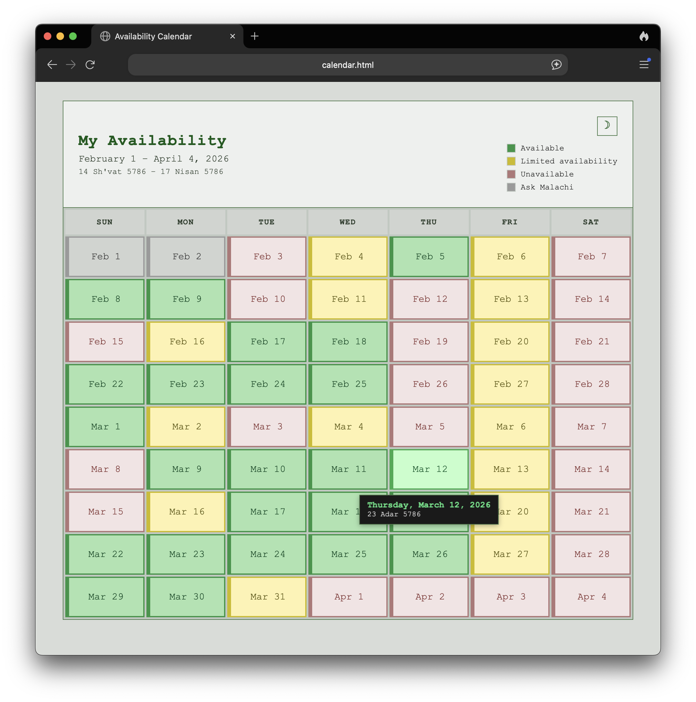

# Simple Availability Calendar

A static availability calendar that runs locally — no server, no build step, just `open calendar.html`.

I built this to give freelance and consulting clients a clear, at-a-glance picture of my availability across several weeks.




## Features

- Color-coded availability: green (available), yellow (limited), red (unavailable), gray (no data yet)
- Shabbos-aware — automatically accounts for the Jewish Sabbath (Friday evening through Saturday)
- Hebrew calendar dates alongside Gregorian dates, computed via [@hebcal/core](https://github.com/hebcal/hebcal-es6)
- Light and dark theme
- Hover tooltips (tap on mobile) with additional details for each date
- Responsive layout down to small phones
- Legend that only shows statuses present in the data

## Usage

You'll need [pnpm](https://pnpm.io/installation) installed. Once you have it, install dependencies and generate a calendar with the date range you want to display:

```bash
pnpm install
pnpm generate-calendar 2026-02-01 2026-04-04 ./my-calendar  # YYYY-MM-DD format
```

This creates a self-contained calendar at the destination with all the files needed to run, including a starter `calendar-statuses.js`.

Edit `calendar-statuses.js` in the destination to fill in your availability — the examples in that file show the format for each status type and how to add notes.

Open `calendar.html` from the destination in a browser. No server needed.

Re-running with the same destination will update the date range without overwriting your `calendar-statuses.js` edits.

## Design decisions

**No build step.** I originally envisioned three files: HTML, JS, CSS. The project outgrew that — there are now several source files, a generator script, and tests — but the core constraint held: you can still open `calendar.html` from a file path and it works.

**Separated generated data from user data.** `calendar-dates.js` is generated by the tool; `calendar-statuses.js` is hand-edited. The app merges them at runtime and applies Shabbos rules automatically. This means you can regenerate the date range without accidentally losing your availability entries.

**Read-only UI.** There's no editing interface — you edit a JavaScript file directly. This kept the visual design simple and let me iterate faster. It works for me because I can use tools like Claude Code or OpenCode to help update and maintain the data.

**Built in vertical slices.** Each feature was built end-to-end — data, logic, UI, and tests together — and shipped as an independent commit. This kept the project in a working state at every stage.

## Tradeoffs and what I'd do differently

**Should have used TypeScript and a framework.** I underestimated the complexity. What started as three files grew into something that would benefit from proper modules, type checking, and component architecture.

**Globals instead of ES modules.** A consequence of the no-build constraint. It works, but the `typeof` guards for browser/Node compatibility are awkward.

**Limited scope is deliberate.** There's no database, no holiday detection beyond Shabbos, no editing UI, no navigation between months. The original vision was three files simple enough to send to someone — no dependencies, just open the HTML. That grew more complex, but you can still send it as a compressed directory that opens without any installation, though that's more awkward than I'd like. I also set a firm two-week deadline and cut scope to fit rather than expanding the timeline. If I continue this work, I'd probably incorporate this into a larger app with a proper database rather than continuing to grow it in place.

**Frontend testing is a gap.** Tests cover the data and logic layer well, but there's no component testing, browser-level end-to-end testing, or accessibility testing. That's something I want to learn — it just wasn't going to happen in this project.

## What I learned

**Test-driven development works well with AI coding tools.** Writing a failing test first gives the AI a clear, closed-ended target. It catches subtle mistakes and keeps the human in control of _what_ gets built.

**Shorter sessions, better results.** Focused, atomic, single-task sessions with Claude Code produced better code than long, sprawling ones — and used fewer tokens.

**Working with AI tools requires active judgment.** Claude Code is productive enough to be a regular part of my workflow, but its output needs steady correction — it drifts toward verbosity, makes small errors that compound, and requires repeated guidance on workflow preferences. In one case, it kept producing incorrect unit tests that I had to go in and fix by hand. I did give it more autonomy on the final UI restyling, where I had prior good experience with AI-assisted styling and was working against a deadline — but even there, I was evaluating the results, not accepting them.

## Inspiration

This project was inspired by three things from Basecamp's [dot grid calendar case study](https://basecamp.com/shapeup/1.1-chapter-02#case-study-the-dot-grid-calendar):

- **The design.** The dot grid calendar communicates one thing per day — whether there's an event — across multiple weeks at a glance. I wanted the same idea for availability: a multi-week view where someone can immediately see when I'm free.
- **The complexity.** Basecamp is upfront about how hard calendars are to build. If a well-established software company has to make serious tradeoffs to ship one, I knew I'd need to be even more deliberate about scoping mine.
- **The process.** The case study comes from [Shape Up](https://basecamp.com/shapeup), a book about how Basecamp builds software: set a firm deadline, then cut scope to fit rather than expanding the timeline. I treated this as a two-week project, broke the work into several slices that each delivered a complete feature, and used test-driven development throughout.

## Stack

- [Vitest](https://vitest.dev/) — test framework
- [Prettier](https://prettier.io/) — code formatting
- [Husky](https://typicode.github.io/husky/) — pre-commit hooks
- [@hebcal/core](https://github.com/hebcal/hebcal-es6) — Hebrew date calculation
- [pnpm](https://pnpm.io/installation) — package manager
- Vanilla JavaScript, CSS Grid, HTML

## License

AGPL-3.0-only
